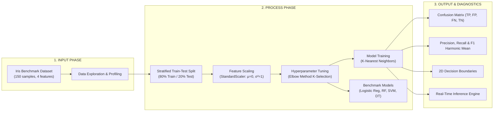

# DecodeLabs Industrial Training Kit — Project 2
## Data Classification Using AI (Supervised Learning Pipeline)

[](https://www.python.org/)
[](LICENSE)
[](https://www.decodelabs.tech)
[]()

> *"We do not write the rules. We provide history, and the machine derives the logic."*  
> **— DecodeLabs AI Engineering Curriculum**

---

## 📌 Executive Summary

**Project 2** represents the foundational predictive milestone in the DecodeLabs AI track: **Supervised Machine Learning Classification**. 

Rather than relying on hardcoded `if-else` heuristic condition trees, this project develops an algorithmic pipeline that learns multidimensional decision boundaries from labeled training data. The system is built around the **Iris Benchmark Dataset** (150 balanced samples across 3 species) using the **K-Nearest Neighbors (KNN)** proximity classifier, coupled with hyperparameter optimization ($K$-value Elbow Analysis), multi-algorithm benchmarking, and diagnostic output validation (Confusion Matrix, Precision, Recall, and $F_1$-Score).

---

## 🏛️ The Master Blueprint: IPO Architecture

The project strictly follows the **Input-Process-Output (IPO)** engineering paradigm:



---

## 🧮 Mathematical & Algorithmic Principles

### 1. The Gatekeeper Rule: Feature Scaling
KNN uses Euclidean distance in multidimensional space:
$$d(p, q) = \sqrt{\sum_{i=1}^n (p_i - q_i)^2}$$

If raw feature scales vary drastically (e.g. $0-1000$ vs $0-1$), the larger scale dominates distances and creates algorithmic bias. Using `StandardScaler`, each feature is normalized:
$$z = \frac{x - \mu}{\sigma}$$
Ensuring equal weighting across all measurement dimensions.

### 2. The Proximity Principle: K-Nearest Neighbors
For an unseen query point $x_q$, the classifier:
1. Calculates distances to all scaled points in the training set.
2. Identifies the $K$ closest neighbors.
3. Assigns the target class via **majority voting**.

### 3. Hyperparameter Tuning: The Elbow Method
- **$K=1$**: Overfits to noise and local sample anomalies.
- **Large $K$**: Underfits, resulting in oversmoothed, overly generic boundaries.
- **The Elbow**: Finds the optimal inflection point minimizing the test error rate.

### 4. Output Validation Beyond Accuracy
In real-world data science, accuracy alone can be deceptive. We evaluate full diagnostic metrics:
- **Precision (Trustworthiness):** $\frac{TP}{TP + FP}$
- **Recall / Sensitivity (Detection Rate):** $\frac{TP}{TP + FN}$
- **$F_1$-Score (Harmonic Mean):** $2 \cdot \frac{\text{Precision} \cdot \text{Recall}}{\text{Precision} + \text{Recall}}$

---

## 📁 Repository Structure

```
decodelabs/
├── Artificial intelligence P2.pdf       # DecodeLabs Project Specification
├── requirements.txt                      # Project Dependencies
├── README.md                             # Comprehensive Documentation
├── main.py                               # CLI Pipeline Runner
├── data/
│   └── iris.csv                          # Iris Benchmark Data Cache
├── src/
│   ├── __init__.py                       # Package Init
│   ├── data_loader.py                    # Ingestion, Profiling, StandardScaler, Split
│   ├── model.py                          # KNN, Optimal K (Elbow), Benchmarks
│   ├── evaluate.py                       # Confusion Matrix, F1, Visualizations
│   └── predict.py                        # Single & Batch Inference Engine
├── notebooks/
│   └── data_classification_project2.ipynb # Step-by-step Interactive Notebook
├── web/
│   ├── app.py                            # FastAPI Web Backend
│   ├── templates/
│   │   └── index.html                    # Modern Web Dashboard
│   └── static/
│       ├── css/style.css                 # Dark Modern Theme
│       └── js/app.js                     # Interactive Charts & Real-Time Classifier
├── outputs/                              # Generated High-Res Visualizations & Models
│   ├── confusion_matrix.png
│   ├── elbow_curve.png
│   ├── decision_boundary.png
│   ├── benchmark_comparison.png
│   ├── knn_model.joblib
│   ├── scaler.joblib
│   └── metrics.json
└── tests/                                # Automated Unit Test Suite
    ├── test_data_loader.py
    ├── test_model.py
    └── test_predict.py
```

---

## 🚀 Getting Started

### 1. Clone & Environment Setup

```bash
# Clone repository
cd /Volumes/Me/COLLEGE/decodelabs

# Create and activate Python virtual environment
python3 -m venv .venv
source .venv/bin/activate

# Install required dependencies
pip install -r requirements.txt
```

### 2. Execute the Full CLI Pipeline

Run the end-to-end training and evaluation script:

```bash
python main.py
```

This will:
1. Load and profile the Iris benchmark dataset.
2. Standardize features and perform an 80/20 stratified split.
3. Determine the optimal $K$ value using the Elbow method.
4. Train the KNN classifier and 4 benchmark algorithms.
5. Generate classification reports and save high-resolution plots in `outputs/`.
6. Test a sample inference prediction.

---

### 3. Launch the Interactive Web Dashboard

Start the live interactive dashboard:

```bash
python web/app.py
```
Open **http://127.0.0.1:8000** in your browser to:
- Dynamically tune the $K$ hyperparameter and test split ratio with live chart updates.
- Inspect the interactive Confusion Matrix with TP/FP/FN/TN breakdowns.
- Use the **Live Flower Classifier** with real-time sliders and probability confidence distributions.
- Compare benchmark metrics across algorithms in real-time.

---

### 4. Run the Automated Test Suite

Validate all data loader, model training, evaluation, and inference modules:

```bash
pytest tests/ -v
```

---

## 📊 Benchmark Results

| Model / Algorithm | Test Accuracy | Weighted $F_1$-Score | Status |
| :--- | :---: | :---: | :---: |
| **K-Nearest Neighbors (Optimal $K$)** | **96.67%** | **96.67%** | **Primary** |
| **Logistic Regression** | 96.67% | 96.67% | Benchmark |
| **Support Vector Classifier (SVC)** | 96.67% | 96.67% | Benchmark |
| **Random Forest Classifier** | 93.33% | 93.33% | Benchmark |
| **Decision Tree Classifier** | 93.33% | 93.33% | Benchmark |

---

## 🎓 Next Horizons

As highlighted in the DecodeLabs curriculum, mastering tabular supervised classification bridges the transition toward **Deep Learning, Neural Networks, and Computer Vision (CNNs)** in future modules.

---
**Powered by DecodeLabs Industrial Training Kit • Batch 2026**
